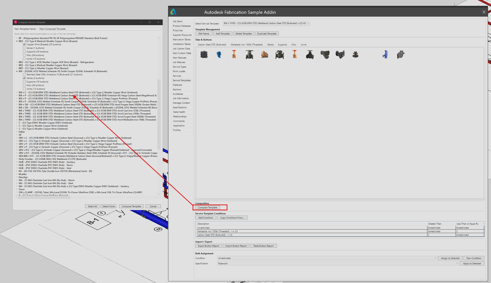
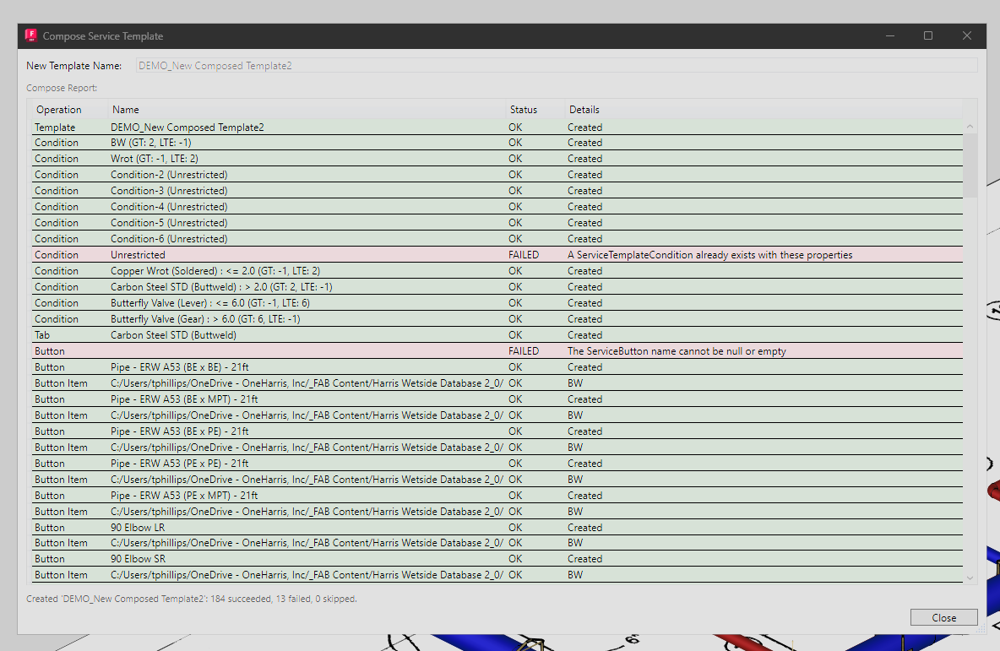
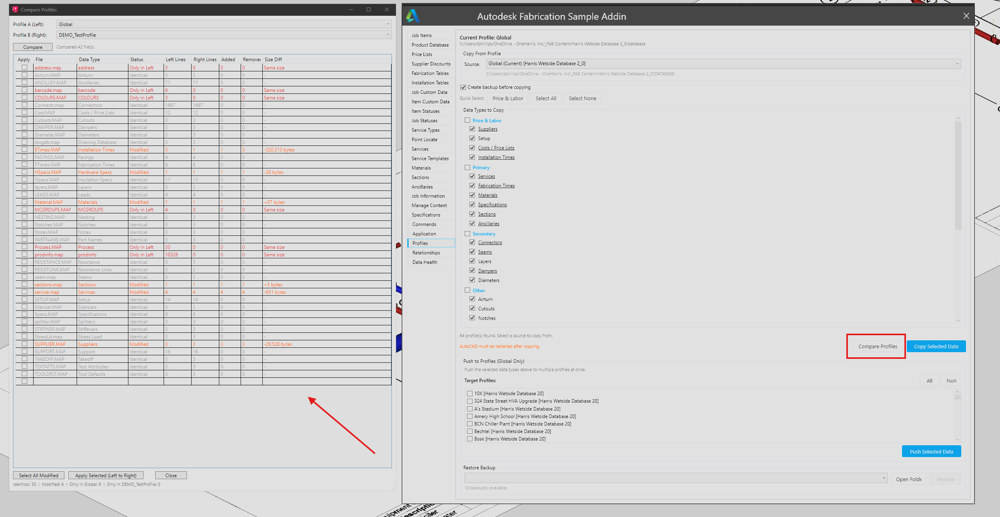
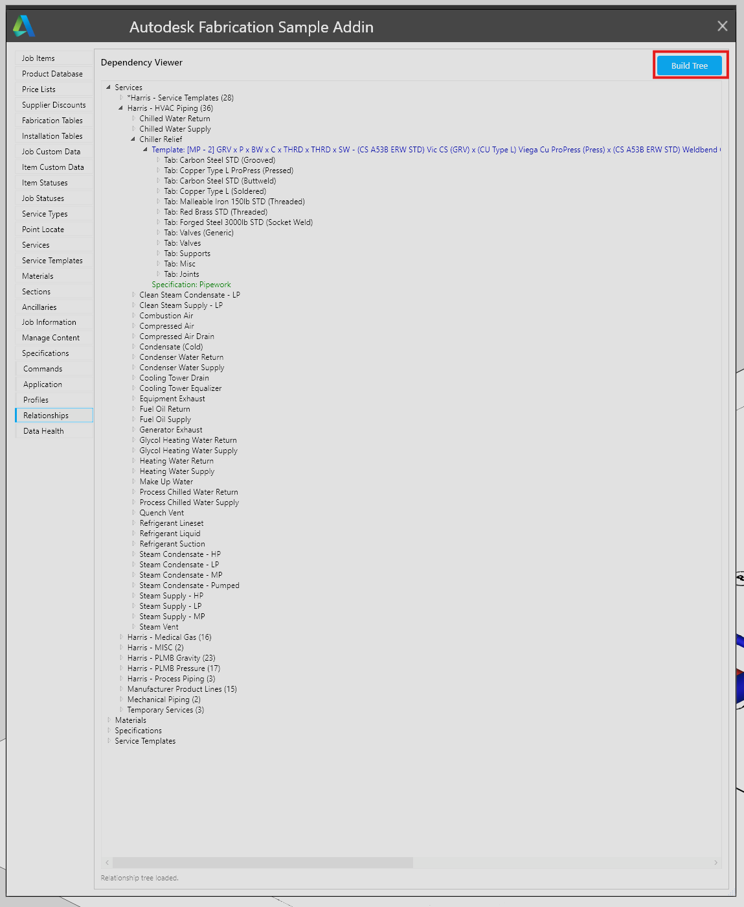
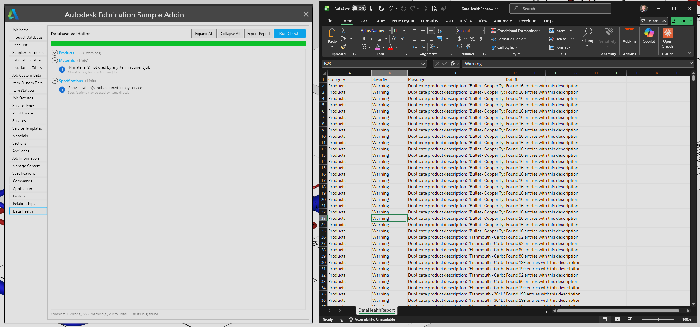
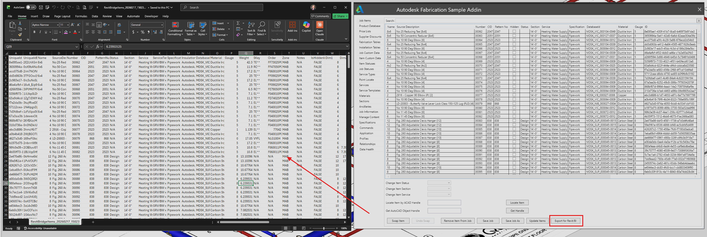

# FabricationSample

Extended Autodesk Fabrication API Sample plugin for CADmep / ESTmep / CAMduct (Fabrication 2024).

> **This is a fork of [MartinMagallanes/FabricationSample](https://github.com/MartinMagallanes/FabricationSample)** with significant feature additions for production use. See [Summary of Extended Features](#summary-of-extended-features) below.


*The Commands tab — the recommended starting point. All export and import operations in one place, with a scrollable CSV preview before saving.*

## Authors and Credits

This project builds on the original Autodesk Fabrication API Sample (shipped with the Fabrication SDK), updated for modern Fabrication versions and extended with production features for cross-configuration content management, data export/import, and profile management.

| Contributor | Role | GitHub |
|-------------|------|--------|
| **Autodesk** | Original author of the Fabrication API Sample application with WPF UI, database editor tabs, and AutoCAD plugin framework. Shipped as part of the Fabrication SDK. | - |
| **Martin Magallanes** | Updated the sample for post-2020 versions of AutoCAD, CADmep, and the Fabrication Suite. Original author of the NETLOAD export commands and DiscordCADmep. Made the project publicly accessible on GitHub. | [MartinMagallanes](https://github.com/MartinMagallanes) |
| **Tyler Phillips** | Extended the application with NETLOAD export/import commands, Content Transfer (cross-config ITM export/import with reference re-resolution), Profile Data Copy, CSV import services, and UI enhancements. | [Ty9112](https://github.com/Ty9112) |

### Referenced Repositories

| Repository | Author | Description |
|------------|--------|-------------|
| [FabricationSample](https://github.com/MartinMagallanes/FabricationSample) | Martin Magallanes | Fabrication API sample updated for post-2020 Fabrication versions (upstream) |
| [DiscordCADmep](https://github.com/MartinMagallanes/DiscordCADmep) | Martin Magallanes | Simpler AutoCAD Fabrication plugin with NETLOAD export commands |
| [fabrication-api-xmldocs](https://github.com/DugganIS/fabrication-api-xmldocs) | DugganIS | XML documentation extracted from FabricationAPI.chm for IntelliSense support. Created by DugganIS — they did the hard work of extracting and structuring the XML docs from Autodesk's .CHM help file so developers can get IntelliSense in Visual Studio. |

---


**Application:** Fabrication Sample (Extended)
**Fabrication Products:** ESTmep, CAMduct, CADmep
**Fabrication Version:** 2024
**Programming Language:** C#
**Type:** ExternalApplication
<br/>**Subject:** Extended Fabrication API sample with content transfer, profile management, and data export/import.
**Summary:** Builds on the original Autodesk Fabrication API Sample with cross-configuration content transfer (ITM export/import with reference re-resolution), profile data copy with selective cleanup and multi-profile push, and CSV import/export services.

See the [Installation](#installation) section for setup instructions.


---

# Summary of Extended Features

The following features have been added to the base Fabrication Sample application by usage of ClaudeCode and additional personal tweaks and projects from the past.

## Table of Contents

- [Installation](#installation)
- [AutoCAD Commands (NETLOAD)](#autocad-commands-netload)
- [FabAPI UI Features](#fabapi-ui-features)
  - [Commands Tab (Recommended Starting Point)](#commands-tab-recommended-starting-point)
  - [CSV Export/Import (Product List, Price List)](#csv-import)
    - [Paste Import (Clipboard)](#paste-import-clipboard)
    - [Column Mapping Window Enhancements](#column-mapping-window-enhancements)
  - [Services Tab Enhancements](#services-tab-enhancements)
    - [Service Conditions](#service-conditions)
    - [Bulk Assignment — Services](#bulk-assignment--services)
  - [Service Templates Tab Enhancements](#service-templates-tab-enhancements)
    - [Service Template Conditions](#service-template-conditions)
    - [Bulk Assignment — Service Templates](#bulk-assignment--service-templates)
  - [Service Editor Enhancements](#service-editor-enhancements)
    - [Multi-Select in Entries and Button Mappings](#multi-select-in-entries-and-button-mappings)
    - [Tab Copy/Paste](#tab-copypaste)
  - [Manage Content Enhancements](#manage-content-enhancements)
    - [Folder Navigation and Back Button](#folder-navigation-and-back-button)
    - [Filter for Blank Columns](#filter-for-blank-columns)
    - [Extended Folder Contents Grid](#extended-folder-contents-grid)
    - [Bulk Assignment — Content Items](#bulk-assignment--content-items)
  - [Profile Data Copy (Experimental)](#profile-data-copy-experimental)
    - [Selective Cleanup](#selective-cleanup)
    - [Push to Profiles (Global Only)](#push-to-profiles-global-only)
    - [Compare Profiles](#compare-profiles)
    - [OneDrive and Network Storage Considerations](#onedrive-and-network-storage-considerations)
  - [Content Transfer (Experimental)](#content-transfer-experimental)
  - [Item Swap with Undo (Experimental)](#item-swap-with-undo-experimental)
  - [Application Tab](#application-tab)
  - [Relationship Viewer](#relationship-viewer)
  - [Data Health](#data-health)
  - [Export for Revit / BI](#export-for-revit--bi)
- [Feature Risk Guide](#feature-risk-guide)
- [Tabs Reference](#tabs-reference)
- [Project Structure](#project-structure)
- [Building from Source](#building-from-source)
- [API Limitations](#api-limitations)
- [Known Bugs](#known-bugs)

---

## Installation

### Prerequisites

- Autodesk Fabrication 2024 (CADmep, ESTmep, or CAMduct)
- AutoCAD 2024 (for CADmep NETLOAD commands)
- .NET Framework 4.8

### Install for CADmep (AutoCAD Plugin)

1. Build the solution or use the pre-compiled DLL from `bin\x64\Release\`
2. Copy the `ACAD\FabricationSample.bundle` folder to:
   ```
   C:\ProgramData\Autodesk\ApplicationPlugins\
   ```
3. Copy `FabricationSample.dll` from the build output into the bundle folder
4. A **"Fabrication Sample"** button will appear on the AutoCAD **Add-Ins** tab
5. Click it to open the FabAPI window, or type `FabAPI` at the AutoCAD command line

### Install for ESTmep / CAMduct (Fabrication Addin)

1. Copy `FabricationSample.dll` and `FabricationSample.addin` to:
   ```
   C:\ProgramData\Autodesk\Fabrication\Addins\2024\
   ```
2. Launch ESTmep or CAMduct — the addin loads automatically
3. The FabAPI window opens when the addin initializes

### NETLOAD Commands (CADmep Only)

For quick command-line access without the full FabAPI UI:

1. In AutoCAD, type `NETLOAD` at the command line
2. Browse to and select `FabricationSample.dll`
3. The commands listed below become available at the AutoCAD command prompt

---

## AutoCAD Commands (NETLOAD)

These commands are available after loading the DLL via `NETLOAD` or the AutoCAD plugin framework. Each exports fabrication data to CSV files.

### Export Commands

| Command | Description |
|---------|-------------|
| `FabAPI` | Opens the main FabAPI WPF window with all tabs and features |
| `GetProductInfo` | Exports product database entries with prices and labor rate values to CSV |
| `ExportItemData` | Exports service items with product list entries and dimensions to CSV |
| `GetPriceTables` | Exports price lists and breakpoint table data to CSV |
| `GetInstallationTimes` | Exports installation times tables with breakpoint values to CSV |
| `GetItemLabor` | Exports items with calculated labor values derived from breakpoint tables |
| `GetItemInstallationTables` | Exports items with their assigned installation times tables |
| `GetServiceTemplateData` | Exports service template data (prompts with a service selection dialog) |


*The Product Database tab displays all product entries with their properties. Export and import buttons at the bottom allow CSV data transfer.*


*The Services tab with the service selection dialog. Select which services to include when exporting service data or button reports.*


*The Service Templates tab showing template conditions and button items. The Compose Template button opens the Template Composer for building tab/button structures. Export Button Report and Import Button Report are available for CSV-based template data management.*

### Import Commands

| Command | Description |
|---------|-------------|
| `ImportProductList` | Imports product list rows from a CSV file with column mapping |
| `ImportPriceList` | Imports price list data from a CSV file |
| `ImportProfileData` | Imports profile database files (.MAP files) from a source profile folder |

---

## FabAPI UI Features

The FabAPI window (`FabAPI` command) provides a tabbed interface for interacting with the Fabrication database. The following sections document the extended features added beyond the original Autodesk sample.

---

### Commands Tab (Recommended Starting Point)

**Location:** FabAPI Window > **Commands** tab

If you're new to this plugin, the **Commands tab is the best place to start**. It provides a centralized hub for all export and import operations in a single, user-friendly interface — no need to navigate individual tabs or remember NETLOAD command names.

#### Why Start Here

The Commands tab consolidates every export and import operation into one place with:
- **Checkboxes** to select which commands to run
- **Quick-select buttons** (Select All, Select None, Exports Only, Imports Only)
- **Descriptions** for each command so you know what you're getting
- **Sequential execution** with a progress bar when running multiple commands
- **Scrollable CSV preview** before saving any export — see exactly what data you're getting before committing to a file

This is the safest way to explore the Fabrication database. Every export is **read-only** — it extracts data to CSV without modifying anything in the database. You can run all 7 exports to get a comprehensive snapshot of your configuration's data.

#### Available Export Commands

| Command | Description |
|---------|-------------|
| Get Product Info | Full product export with prices, labor, supplier IDs |
| Export Item Data | Service items with product list entries and conditions |
| Get Price Tables | Price lists and breakpoint tables (multi-file, prompts for table selection) |
| Get Installation Times | Installation times tables (multi-file, prompts for table selection) |
| Get Item Labor | Items with calculated labor from breakpoint tables |
| Get Item Installation Tables | Items with assigned installation table mappings |
| Get Service Template Data | Service template buttons, codes, and item paths (prompts for service selection) |

#### Available Import Commands

| Command | Description | Notes |
|---------|-------------|-------|
| Import Installation Times | Installation times from CSV | Active |
| Import Product Database | Product definitions and supplier IDs | Active |
| Import Supplier Discounts | Discount codes from CSV | Active |
| Import Button Report | Service template button codes | Active |
| Import Price List | Price data into a selected price list | Disabled — requires price list selection on Price Lists tab |

#### Export Preview

When you run an export command from the Commands tab, the data is first exported to a temporary file and displayed in a **scrollable preview window** with a DataGrid. You can:
- Scroll through all rows and columns to verify the data
- Resize the preview window by dragging edges or corners
- Click **Save As...** to choose where to save the file
- Click **Cancel** to discard without saving

For multi-file exports (Price Tables, Installation Times), the preview shows the first file from the set. After clicking Save As, all files are saved to the chosen folder.

#### How to Use

1. Open the FabAPI window and navigate to the **Commands** tab
2. Check the commands you want to run (use quick-select buttons for bulk selection)
3. Click **Run Selected Commands**
4. Confirm the list of commands to execute
5. Each command runs sequentially — for exports, you'll see a preview and choose where to save; for imports, you'll go through the standard file selection and column mapping workflow
6. A summary dialog shows results when all commands complete

---

### CSV Import

This is the most stable and tested part of the plugin. Export and import operations for CSV data have been through the most iteration and testing.


*The Price Lists tab with the Column Mapping window open. Map your CSV columns to the expected import fields, preview the data, then import. Export and import buttons are highlighted at bottom-right.*


*The Installation Tables tab showing breakpoint table values with the Column Mapping window for importing installation times from CSV. Update, Import, and Export buttons are at the bottom-right.*

#### Import Product List

**Command:** `ImportProductList` (NETLOAD) or via FabAPI UI

Imports product list rows from a CSV file into the Fabrication database.

1. Run the command or use the UI import function
2. Select a CSV file
3. A **Column Mapping** window appears — map your CSV columns to the expected fields:
   - Name, Alias, Database ID, Order Number, Bought Out, Weight
4. Preview the data to verify mappings
5. Confirm to import the rows into the target product list

#### Import Price List

**Command:** `ImportPriceList` (NETLOAD) or via FabAPI UI

Imports price list data from a CSV file.

1. Run the command
2. Select a CSV file and map columns
3. Preview and confirm the import

#### Paste Import (Clipboard)

Every tab with an import button also has a **Paste Import** button. This replicates the traditional ESTmep workflow where you copy tabular data from a spreadsheet or ESTmep's grid and paste it directly into the import pipeline.

**How to use:**
1. Copy data from ESTmep, Excel, or any spreadsheet (rows and columns)
2. Click **Paste Import** on the relevant tab (Price Lists, Product Database, Installation Times, Supplier Discounts, Item Statuses, Job Statuses, Services, or Service Templates)
3. The Column Mapping window opens with the pasted data
4. Map columns to import fields, preview the data, and confirm

**Delimiter detection:** Tab-separated data (from ESTmep/Excel) and comma-separated data are both auto-detected. The delimiter with more occurrences in the first row wins.

**Available on all import tabs:**
- Price Lists, Product Database, Supplier Discounts
- Installation Times, Item Statuses, Job Statuses
- Services (Button Report), Service Templates (Button Report)

#### Column Mapping Window Enhancements

The Column Mapping window (used by both file import and paste import) has been enhanced with:

- **"My data has headers" checkbox** — Auto-detects whether the first row contains column headers by matching values against expected field names. When unchecked, columns are labeled `Col 1`, `Col 2`, etc. and the first row is treated as data (not skipped during import). Toggle at any time to re-map columns.
- **Scrollable data preview** — The preview shows all data rows (not just the first 10) with both vertical and horizontal scrolling via mouse hover, matching the behavior of the main tab DataGrids.
- **Dynamic row count** — The preview label shows the actual number of data rows (e.g., "Data Preview (247 rows)").

---

### Services Tab Enhancements

**Location:** FabAPI Window > **Services** tab (bottom panel)

#### Service Conditions

The Services tab now includes a **Service Conditions** section that mirrors the layout of Service Template Conditions. Because conditions are defined at the template level (not the service level), this section displays and edits conditions on the service's linked Service Template directly — making it possible to manage conditions without switching tabs.

> **Note:** Edits made here modify the linked Service Template and will affect all services that share that template.

| Action | How |
|--------|-----|
| **View conditions** | Automatically populated when a service is selected from the dropdown |
| **Add a condition** | Click **Add Condition** — opens the standard condition dialog with Description, Greater Than, and Less Than or Equal To fields |
| **Edit a condition** | Click a cell in the DataGrid and type — changes save on row commit |
| **Delete a condition** | Right-click the row > **Delete Condition** |
| **Fill down (Shift+D)** | Select multiple rows, press Shift+D to copy the top row's values to all selected rows below it |

#### Bulk Assignment — Services

The **Bulk Assignment** section at the bottom of the Services tab provides shortcuts for applying conditions and specifications to multiple service buttons at once.

| Action | How |
|--------|-----|
| **Assign condition to selected buttons** | Pick a condition from the dropdown, select buttons in the Tabs & Buttons panel, click **Assign to Selected** |
| **Create a new condition** | Click **New Condition** — creates a condition on the service's template and selects it in the dropdown |
| **Apply specification to button items** | Pick a specification from the grouped dropdown, select buttons, click **Apply to Selected** — applies `ChangeSpecification()` to each item on each selected button |

---

### Service Templates Tab Enhancements

**Location:** FabAPI Window > **Service Templates** tab (bottom panel)

#### Service Template Conditions

The conditions DataGrid supports full inline editing:

| Action | How |
|--------|-----|
| **Add a condition** | Click **Add Condition** |
| **Copy conditions from another template** | Click **Copy Conditions From...** — select a source template |
| **Edit Description / bounds** | Click a cell and type; `-1` or `Unrestricted` = no bound |
| **Delete** | Right-click > **Delete Condition** |
| **Fill down (Shift+D)** | Select rows, Shift+D copies top row to all selected |

#### Bulk Assignment — Service Templates

Same pattern as the Services tab: assign conditions and specifications to selected buttons on the current template.

#### Template Composer

The **Compose Template** button opens the Template Composer window, which lets you build or rebuild service template tabs and buttons programmatically from a structured definition. Select an existing template as the source structure, choose which tabs and buttons to compose, and the system creates the full tab/button/item tree in the target template.


*The Service Templates tab with the Compose Template button highlighted (top). The Template Composer window (left) shows a tree of templates and their tabs/buttons for selection.*

After composing, a results report shows each operation (Template, Condition, Tab, Button, Button Item) with its name and status (OK or FAILED), allowing you to verify what was created and identify any items that could not be composed.


*The Compose Service Template results window listing each operation with its type, name, status, and details. FAILED rows indicate items that could not be created (e.g., missing references).*

---

### Service Editor Enhancements

**Location:** FabAPI Window > **Services** or **Service Templates** tab > select a service/template > click the service button in Tabs & Buttons

#### Multi-Select in Entries and Button Mappings

The **Service Entries** and **Button Mappings** DataGrids now support multi-row selection (`SelectionMode="Extended"`). Hold Ctrl or Shift to select multiple rows for reference or bulk operations.

#### Tab Copy/Paste

Right-clicking a tab header in the Tabs & Buttons panel reveals three additional context menu items:

| Menu Item | Description |
|-----------|-------------|
| **Select All Buttons** | Selects all buttons in the current tab — useful before bulk operations |
| **Copy Tab** | Captures all buttons and their button items (item path + condition) into a clipboard buffer |
| **Paste Tab** | Pastes the clipboard buffer into the current tab, creating new buttons that match the copied set — conditions are matched by description in the target template |

Tab copy/paste works across services and templates. The clipboard buffer persists for the current session.

---

### Manage Content Enhancements

**Location:** FabAPI Window > **Manage Content** tab > navigate to any item folder

#### Folder Navigation and Back Button

A **← Back** button in the folder toolbar tracks your navigation history. When you navigate into a subfolder (by double-clicking a folder row or expanding via the tree), the Back button enables. Click it to return to the previous folder. The history stack resets when you navigate via the tree.

#### Filter for Blank Columns

A **Filter blanks:** ComboBox in the toolbar lets you narrow the grid to only items where a specific metadata column has no value assigned:

| Filter Option | Shows rows where… |
|---------------|-------------------|
| Off | All rows (no filter) |
| Specification | Specification is blank |
| Price List | Price List is blank |
| Install Times | Install Times is blank |
| Fab Times | Fab Times is blank |
| Any Blank Column | Any of the above columns is blank |

This is useful for quickly identifying items in a folder that haven't been fully configured. The filter applies on top of the existing grouping (works in both normal and "Show All Subfolders" modes).

#### Extended Folder Contents Grid

The folder contents grid now shows the following additional columns alongside Name and CID:

| Column | Description |
|--------|-------------|
| Service | The service assigned to the item |
| Material | The item's material |
| Specification | The item's specification |
| Price List | The item's assigned price list |
| Install Times | The item's installation times table |
| Fab Times | The item's fabrication times table |
| Bought Out | Whether the item is flagged as bought out |

These columns are populated when a folder is loaded and can be sorted. They give at-a-glance visibility into bulk assignment status across a folder's contents.

#### Bulk Assignment — Content Items

The **Bulk Assignment** panel at the bottom of the Manage Content tab allows applying properties to multiple selected items at once. Check the items you want to update using the checkbox column (or use **Select All** / **Select None**), set the fields you want to change, and click **Apply to Selected**.

| Field | Notes |
|-------|-------|
| Price List | Select from all price lists in the database |
| Installation Times | Select from all installation times tables |
| Fabrication Times | Select from all fabrication times tables |
| Notes / Alias / Drawing Name | Text fields — only applied if non-empty |
| Order / Zone / Equipment Tag / Pallet / Spool Name | Text fields — only applied if non-empty |
| **Bought Out** | **New** — ComboBox with `— No Change —`, `Yes (Bought Out)`, `No (Not Bought Out)`. Only updates items when explicitly set to Yes or No. |

All bulk updates load each item via the Fabrication API, apply the selected properties, and save. Fields left blank or set to "No Change" are skipped.


*The Manage Content tab showing the folder contents grid with metadata columns (Service, Material, Specification, Price List, Install Times, Fab Times, Bought Out). The Show All Subfolders toggle is highlighted in the toolbar. The Bulk Assignment panel at the bottom allows batch updates to selected items.*

---

### Profile Data Copy (Experimental)

> **Note:** This feature is experimental. It overwrites .MAP files directly, so test on a non-critical profile with backups enabled before relying on it in production.

**Location:** FabAPI Window > **Profiles** tab


*The Profiles tab showing copy from Global profile with selective data type checkboxes (Price & Labor, Primary, Secondary groups), quick-select buttons, and the Push to Profiles panel for pushing to multiple named profiles at once.*

Copies database files (`.MAP` files) between Fabrication profiles (e.g., from Global to a named profile, or between named profiles).

#### How to Use

1. Navigate to the **Profiles** tab
2. Select a **Source Profile** from the dropdown (includes "Global" and all named profiles)
3. Select a **Target Profile** (the profile you want to update)
4. Choose which **Data Types** to copy using the checkboxes:
   - Services, Materials, Specifications, Sections, Connectors, Seams
   - Cost tables, Fabrication times, Installation/Estimation times
   - Ancillaries, Dampers, Diameters, Suppliers, Layers
   - Setup, Air turns, and more
5. Click **Copy** to transfer the selected `.MAP` files
6. A backup of the target profile's files is created automatically before overwriting
7. Use **Restore Backup** to revert if needed

#### Selective Cleanup

For enumerable data types, click the data type name (underlined link) to open a **preview window** showing all items from the source. Uncheck items you don't want in the target profile. After the `.MAP` file is copied, a cleanup file is saved that automatically deletes the unwanted items when the target profile is loaded.

Supported data types for selective cleanup:
- **Price & Labor:** Suppliers, Costs / Price Lists, Installation Times
- **Primary:** Services, Fabrication Times, Materials, Specifications, Sections, Ancillaries
- **Secondary:** Connectors, Dampers, Stiffeners

#### Push to Profiles (Global Only)

When on the Global profile, the **Push to Profiles** panel appears. This lets you push selected data types from Global to multiple named profiles at once:

1. Select data types and configure selective items (same as single-copy)
2. Check one or more target profiles in the push panel
3. Click **Push to Profiles**
4. Each target receives the selected `.MAP` files, and if selective items were configured, a per-profile cleanup file (`_pending_cleanup.json`) is saved in each target's DATABASE folder
5. When a target profile is loaded in a future session, the cleanup runs automatically and shows a summary of deleted items

#### Compare Profiles

The **Compare Profiles** button opens a comparison window that diffs two profiles side-by-side at the `.MAP` file level. It shows which files exist only in the left profile, only in the right, or in both, and highlights binary differences between shared files.


*The Profiles tab with the Compare Profiles button highlighted (red box). The comparison window shows a DataGrid of all .MAP files with colored rows indicating Left Only, Right Only, Identical, or Different status.*

The comparison is useful before running a Profile Data Copy to understand exactly which files will change and what is different between configurations.

#### OneDrive and Network Storage Considerations

Many organizations store their Fabrication database on OneDrive, SharePoint-synced folders, or network shares. Profile Data Copy writes `.MAP` files directly to these locations, which introduces several potential issues:

**OneDrive / SharePoint Sync:**
- **File locking:** OneDrive may hold a sync lock on `.MAP` files while uploading. If Profile Copy tries to overwrite a file that OneDrive is actively syncing, the copy can fail with an access denied error. The backup will have already been created, but the target file may be in an inconsistent state.
- **Sync delays:** After copying `.MAP` files, OneDrive may take seconds to minutes to sync the changes to other machines. If another user loads the profile on their machine before sync completes, they'll get the old data.
- **Conflict files:** If two users perform Profile Copy operations targeting the same profile simultaneously, OneDrive may create conflict copies (e.g., `Cost-DESKTOP-ABC123.MAP`) instead of overwriting. These conflict files are ignored by Fabrication and will cause the operations to appear to have no effect.
- **Cleanup file sync:** The `_pending_cleanup.json` file is written to the target profile's DATABASE folder. If OneDrive syncs this file to another machine before the original cleanup runs, the cleanup could run on the wrong machine or run twice.

**Network shares (UNC paths):**
- File locking on network shares can behave differently than local drives. If another user has the target profile loaded in ESTmep/CADmep (which holds `.MAP` files open), the copy will fail.
- Network latency can cause partial writes if the connection drops during a large `.MAP` file copy.

**Recommendations:**
1. **Coordinate with your team** — only one person should perform Profile Copy operations at a time, and other users should close ESTmep/CADmep before the copy begins
2. **Pause OneDrive sync** before performing Profile Copy if your database is on a OneDrive-synced path (right-click the OneDrive tray icon > Pause syncing)
3. **Wait for sync to complete** before having other users load the updated profiles
4. **Always keep backups enabled** (the checkbox is on by default) — this creates a timestamped backup before any changes, which can be restored from the Profiles tab if something goes wrong
5. **Check for conflict files** after a copy — look in the target profile's DATABASE folder for files with machine names appended. Delete these if found and re-run the copy.

---

### Content Transfer (Experimental)

> **Note:** This feature is experimental. The export side is safe and read-only, but the import side re-resolves database references by name and has not been broadly tested across different configurations. Test in a non-production environment first.

**Location:** FabAPI Window > **Manage Content** tab > **Export Items** / **Import Items** buttons

This feature enables transferring `.itm` files (Fabrication item content) between different Fabrication configurations — for example, from a master/template configuration to a job-specific configuration.

#### The Problem It Solves

When you copy an `.itm` file from one Fabrication configuration to another, the internal database references (material, specification, price list, etc.) are stored by **index**, not by name. Index 5 in Config A might be "Copper Pipe" but index 5 in Config B might be "Steel Duct." After copying, the item's references point to the wrong things or to nothing at all.

Traditionally, fixing this requires manually re-setting product info, cost tables, and labor tables by hand using multiple tools (Product Information Editor, ESTmep, Ctrl+Shift+Right-Click bulk operations). Content Transfer automates this process.

#### Export Items


*Export Items: Select .ITM files from the item folder tree (left), then choose an output folder (right). A manifest.json is generated with all database reference names.*

1. Open the FabAPI window and navigate to the **Manage Content** tab
2. Click **Export Items**
3. The Export Items window opens showing a tree view of all item folders with checkboxes
   - Expand folders to see individual `.itm` files
   - Check/uncheck folders to select/deselect all items within them
   - The "Selected: N items" counter updates as you make selections
4. Click **Browse** to choose an output folder
5. Click **Export**

**What gets exported:**
- Each selected `.itm` file is copied to the output folder
- Each companion `.png` thumbnail file is also copied (same name, different extension)
- A `manifest.json` file is generated containing:
  - Configuration name (source config identity)
  - Export timestamp and user info
  - Per-item metadata:
    - File name, source folder path, CID, Database ID
    - **Reference names**: Service, Material, Specification, Section, Price List, Supplier Group, Installation Times Table, Fabrication Times Table
    - Product list data (if applicable): row names, aliases, database IDs, order numbers, bought-out flags, weights

The manifest captures reference **names** (not indices), which enables name-based re-resolution during import.

#### Import Items


*Import Items: Each item shows its database references with validation status. Green "(ok)" means the reference exists in the target configuration; yellow "(!) not found" means you need to assign a replacement from the dropdown.*

1. Open the FabAPI window in the **target** configuration and navigate to the **Manage Content** tab
2. Click **Import Items**
3. A folder browser opens — select the folder previously created by **Export Items** (the one containing `manifest.json`)
4. The Import Items preview window opens showing:
   - Source folder path and configuration name
   - Number of items in the package
   - Per-item details with reference validation status:
     - **Green "(ok)"** — the reference exists in the target database by name
     - **Yellow "(!) not found"** — the reference does not exist in the target database

5. **Reassigning Unmatched References:**
   - For any reference marked with a warning, a dropdown (ComboBox) appears next to it
   - The dropdown is populated with all available values from the **target** database
   - Select a replacement value, or leave it as "(skip - leave unresolved)" to import without fixing that reference
   - Available override types: Material, Specification, Section, Price List, Installation Times Table, Fabrication Times Table
   - Service is report-only (read-only on items and cannot be reassigned via the API)

6. **Select Target Folder:**
   - Use the target folder dropdown to choose which item folder the imported items will be placed into
   - The dropdown shows all item folders in a flattened hierarchy (e.g., "HVAC > Pipe > Copper")
   - Alternatively, click **"..."** to browse to a custom folder path

7. Check/uncheck items you want to import, then click **Import**

8. **Duplicate Database ID Check:**
   - Before importing, the system scans existing `.itm` files in the target folder
   - If any items in the package have Database IDs that already exist in the target folder, a warning dialog appears listing the conflicts
   - You can choose to proceed anyway or cancel

9. **Import Processing:**
   - Each selected `.itm` file is copied to the target folder
   - The companion `.png` file is also copied
   - Each item is loaded via the Fabrication API and references are re-resolved by name:
     - Material: matched by name, applied via `ChangeMaterial()`
     - Specification: matched by name, applied via `ChangeSpecification()`
     - Section: matched by description
     - Price List: matched by name across all supplier groups
     - Installation Times Table: matched by name
     - Fabrication Times Table: matched by name
   - If the user selected override values, those are used instead of the original reference names
   - The item is saved to persist the re-resolved references

10. **Results Dialog:**
    - Shows count of successfully imported items
    - Lists any warnings (unresolved references) and errors
    - The item folder tree automatically refreshes to show the newly imported items

---

### Item Swap with Undo (Experimental)

> **Note:** This feature is experimental and has known positioning issues with undo. It has not been broadly tested. Use with caution and only in a non-production environment until further validation is complete. See [Known Bugs](#known-bugs) for details.

Swap items in the current job with different items from the database, with undo support.

1. Select items in the drawing
2. Use the swap functionality to replace them with items from a different service or pattern
3. If the result is not what you expected, use **Undo** to revert the swap
4. The undo manager tracks all swaps performed in the current session

---

### Relationship Viewer

**Location:** FabAPI Window > **Relationships** tab

The Relationships tab provides a dependency tree viewer for your Fabrication database relationships. It maps how Services link to Service Templates, which Templates contain Tabs, and which Tabs contain Buttons — giving a top-down structural view of your service configuration.


*The Relationships tab with the Dependency Viewer tree expanded. Services branch into service groups, each service links to its Template, and each Template shows its Tabs. The Build Tree button (highlighted) populates the tree from the current database.*

#### How to Use

1. Navigate to the **Relationships** tab
2. Click **Build Tree** to load the full dependency graph from the current database
3. Expand nodes to drill into services → template → tabs → buttons
4. Use this view to identify which templates are shared across services, find templates with no services, or audit tab structure before using Tab Copy/Paste

This is a **read-only** view — no changes are made when building or navigating the tree.

---

### Data Health

**Location:** FabAPI Window > **Data Health** tab

The Data Health tab runs a validation scan across your Fabrication database and content library, checking for common configuration issues such as missing references, unresolved specifications, empty required fields, and orphaned items.


*The Data Health tab with the validation summary panel on the left showing categorized warnings. The right side shows an exported warning report opened in Excel/CSV format.*

#### How to Use

1. Navigate to the **Data Health** tab
2. Click **Run Validation** to scan the current database
3. Results are displayed in a categorized list with counts per issue type
4. Click **Export Report** to save the full warning list to a CSV file for review or sharing

This is a **read-only** scan — it reports issues but does not make any changes.

---

### Application Tab

**Location:** FabAPI Window > **Application** tab

The Application tab displays current Fabrication configuration details, a summary of features added in this fork, and a Resources section with links to documentation and the GitHub README.


*The Application tab displaying the current Fabrication configuration path, a "Features Added in This Fork" summary, and a Resources section with links to the GitHub README and API documentation.*

---

### Export for Revit / BI

**Location:** FabAPI Window > **Job Items** tab

The **Export for Revit / BI** button exports the current job's fabrication items to an Excel-compatible format suitable for import into Revit schedules or business intelligence tools (Power BI, Excel pivot tables, etc.).


*The Job Items tab with the Export for Revit / BI button highlighted. The resulting Excel spreadsheet (left) shows item data in a structured format ready for Revit schedule import or BI consumption.*

The export includes item dimensions, service information, material, specification, price list, and other properties needed to match Revit family parameters or BI data models.

---

## Feature Risk Guide

Not all features carry the same risk. Here's a quick reference to help you decide what's safe to try immediately and what deserves more caution.

### Safe — Read-Only Operations (Start Here)

These features **do not modify the Fabrication database**. They only read data and export it to files. You can run these freely without any risk to your configuration.

| Feature | What It Does |
|---------|-------------|
| **Commands Tab > All Exports** | Exports data to CSV files. Preview before saving. No database changes. |
| **NETLOAD Export Commands** | Same exports via command line. Read-only. |
| **Application Tab** | Displays configuration info. No changes. |

**Recommendation:** Start with the Commands tab. Run all 7 exports to get a full snapshot of your database. Review the CSV previews to understand your data before attempting any imports or copies.

### Moderate Risk — Data Imports and Bulk Edits

These features **modify records in the Fabrication database** by updating or adding data. Changes are applied directly — there is no built-in undo.

| Feature | Risk | Mitigation |
|---------|------|-----------|
| **Import Installation Times** | Updates existing installation rate records | Validate column mapping carefully; preview shows update vs. new counts before confirming |
| **Import Product Database** | Updates product definitions and supplier IDs | Only modifies products matching by ID; preview shows exactly what changes |
| **Import Supplier Discounts** | Updates discount codes | Limited scope — only affects discount values |
| **Import Button Report** | Updates service template button codes | Only modifies matching buttons by service/tab/name |
| **Import Price List** | Updates price list entries | Requires selecting the target price list first on the Price Lists tab |
| **Paste Import (all tabs)** | Same as file import, but reads from clipboard | Same validation, preview, and column mapping — data source is clipboard instead of a file |
| **Bulk Assignment — Manage Content** | Updates Price List, Install/Fab Times, text fields, and Bought Out on multiple .itm files | Only selected items are updated; unset fields are skipped; review selections before clicking Apply |
| **Bulk Assign Condition (Services/Templates)** | Adds button items to service buttons | Select correct condition and buttons first; no preview before apply |
| **Bulk Apply Specification (Services/Templates)** | Calls `ChangeSpecification()` on items linked to selected buttons | Modifies .itm files on disk; can affect items used across multiple services |
| **Add/Edit/Delete Service Conditions** | Modifies conditions on Service Templates | Since conditions are template-level, changes affect all services that share the template |
| **Tab Copy/Paste** | Creates new service buttons by copying from another tab | Pastes to the current tab; confirm the target tab and template before pasting |

**Recommendations:**
1. **Export first, import second.** Always run the corresponding export (e.g., Get Product Info) before importing so you have a baseline to compare against
2. **Review the preview carefully.** The column mapping window and import preview show you exactly what will change. If the counts look wrong, cancel and check your CSV
3. **Test on a non-production profile first.** Copy your profile, import into the copy, verify the results, then repeat on the real profile
4. **Back up your .MAP files** before importing. Profile Data Copy's backup feature can help, or just manually copy the DATABASE folder

### Experimental — File-Level Operations (Test in Non-Production First)

These features **copy or overwrite database files (.MAP files) and item files (.ITM files)**. They operate at the file level, which means mistakes can affect the entire profile or configuration. All features in this tier are considered experimental and should be tested in a non-production environment first.

| Feature | Risk | Mitigation |
|---------|------|-----------|
| **Profile Data Copy (Experimental)** | Overwrites target profile's .MAP files | Automatic backup created before copy; can restore from Profiles tab |
| **Push to Profiles (Experimental)** | Overwrites .MAP files across multiple profiles at once | Same backup protection, but applied to many profiles simultaneously — a mistake affects all targets |
| **Content Transfer Export** | Copies .ITM files out — **read-only**, safe | No risk to source configuration |
| **Content Transfer Import (Experimental)** | Copies .ITM files in and re-resolves database references | Can create items with unresolved references if names don't match; duplicate DB ID warning exists but proceeding overwrites existing items |
| **Item Swap (Experimental)** | Replaces items in a drawing | Has undo, but restored items may not return to original coordinates. Not broadly tested. See [Known Bugs](#known-bugs) |

**Recommendations:**
1. **Always leave "Create backup" checked** when using Profile Data Copy. This is on by default — don't turn it off
2. **Coordinate with your team.** Other users should close ESTmep/CADmep before you push to their profiles. See the [OneDrive section](#onedrive-and-network-storage-considerations) for additional concerns with shared storage
3. **Start with a single profile** before using Push to Profiles. Copy to one named profile, load it, verify everything looks right, then push to the rest
4. **For Content Transfer imports,** carefully review the reference validation in the import preview. Green "(ok)" means the reference exists in the target; yellow warnings mean you need to manually assign a replacement or the reference will be left unresolved
5. **Restart AutoCAD/ESTmep after Profile Data Copy.** The Fabrication API loads .MAP files at startup and caches them in memory. Copied files won't take effect until the next session

---

## Tabs Reference

The FabAPI window contains the following tabs:

| Tab | Description |
|-----|-------------|
| Job Items | View and edit items in the current fabrication job |
| Product Database | Browse the product database entries |
| Price Lists | View and edit price lists and breakpoint tables |
| Supplier Discounts | Manage supplier discount codes and values |
| Fabrication Tables | View and edit fabrication times breakpoint tables |
| Installation Tables | View and edit installation times breakpoint tables |
| Job Custom Data | Manage job-level custom data fields |
| Item Custom Data | Manage item-level custom data fields |
| Item Statuses | Configure item status definitions |
| Job Statuses | Configure job status definitions |
| Service Types | View service type definitions |
| Point Locate | Point location data for job items |
| **Services** | **Browse services; edit Service Conditions; bulk assign conditions and specifications to buttons** |
| **Service Templates** | **Edit template conditions inline; bulk assign conditions and specifications; copy/paste tabs between templates** |
| Materials | Browse materials and their gauges |
| Sections | Browse section definitions |
| Ancillaries | Browse ancillary items and their details |
| Job Information | View job properties and status history |
| **Manage Content** | **Item folder tree with back navigation, blank column filter, extended metadata grid, and bulk property assignment** |
| Specifications | Browse specification definitions |
| **Commands** | **Centralized hub for all export/import operations with preview and progress** |
| Application | View application paths, configuration info, What's New, and Resources |
| **Profiles** | **Profile data copy between configurations, Compare Profiles diff tool, and backup/restore** |
| **Relationships** | **Dependency tree viewer — Services → Templates → Tabs → Buttons (read-only)** |
| **Data Health** | **Validation scan for configuration issues; exports warning report to CSV** |

---

## Project Structure

```
FabricationSample/
├── Sample.cs                              # Entry point, FabAPI command
├── Commands/
│   ├── ExportCommands.cs                  # NETLOAD CSV export commands
│   └── ImportCommands.cs                  # NETLOAD CSV import commands
├── ContentTransfer/                       # ITM cross-config export/import
│   ├── Models/
│   │   └── ContentPackage.cs              # Manifest data models
│   ├── Services/
│   │   ├── ItemContentExportService.cs    # Export logic + manifest generation
│   │   └── ItemContentImportService.cs    # Import logic + reference re-resolution
│   └── Windows/
│       ├── ItemExportWindow.xaml(.cs)      # Export selection UI
│       └── ItemImportWindow.xaml(.cs)      # Import preview + override UI
├── ProfileCopy/                           # Profile data copy feature
│   ├── Models/
│   ├── Services/
│   └── Windows/
├── Services/
│   ├── Export/                            # CSV export service implementations
│   ├── Import/                            # CSV import service implementations
│   └── ItemSwap/                          # Item swap with undo
├── Models/                                # Shared data models
├── UserControls/
│   ├── DatabaseEditor/                    # Main tabbed UI (partial class)
│   │   ├── DatabaseEditor.xaml            # XAML layout for all tabs
│   │   ├── DatabaseEditor.xaml.cs         # Core code-behind
│   │   ├── DatabaseEditor-Commands.cs     # Commands tab logic and command registry
│   │   ├── DatabaseEditor-ContentTransfer.cs  # Export/Import button handlers
│   │   ├── DatabaseEditor-Import.cs       # CSV import handlers
│   │   └── ...                            # Other partial class files
│   ├── ServiceEditor/                     # Service editing views
│   └── ItemFolders/                       # Item folder tree view
├── Windows/                               # Shared dialog windows
│   ├── ExportPreviewWindow.xaml(.cs)      # Scrollable CSV preview before save
│   └── ...                                # Selection and editing dialogs
└── Utilities/                             # Helper classes
```

---

## Building from Source

### Requirements

- Visual Studio 2022
- .NET Framework 4.8 targeting pack
- AutoCAD 2024 (for API DLLs: `accoremgd.dll`, `acdbmgd.dll`, `acmgd.dll`)
- Fabrication 2024 CADmep (for `FabricationAPI.dll`)

### Build Command

```bash
"C:\Program Files\Microsoft Visual Studio\2022\Enterprise\MSBuild\Current\Bin\MSBuild.exe" FabricationSample.sln /p:Configuration=Release /p:Platform=x64
```

Output: `bin\x64\Release\FabricationSample.dll`


---

## API Limitations

The following are confirmed limitations of the Fabrication API (`FabricationAPI.dll`, version 2024/2025) discovered while building this plugin. Features that appear in the Fabrication CADmep database UI but are not accessible through the public API are documented here so they are not re-investigated unnecessarily.

---

### Service Template Condition Properties

**What's missing:** The `ServiceTemplateCondition` class exposes only four members:

| Property / Method | Type | Notes |
|-------------------|------|-------|
| `Description` | `string` | Readable and writable |
| `GreaterThan` | `double` | Read-only; use `SetConditionValues()` to change |
| `LessThanEqualTo` | `double` | Read-only; use `SetConditionValues()` to change |
| `Id` | identifier | Read-only |

**Not exposed through the API:**

| Field visible in CADmep UI | Notes |
|----------------------------|-------|
| **Supports (Support Specification)** | The "Supports" column in the Fabrication database conditions grid links a condition to a hanger/support specification. This relationship is stored internally but is not accessible via `ServiceTemplateCondition` — no `SupportSpecification`, `Supports`, or `SupportPosition` property exists on the class in 2024 or 2025 API versions. |
| **Support Positions** | Position-level support assignment per condition is likewise not surfaced. |
| **Condition type / category** | There is no way to distinguish condition "types" — all conditions appear as Description + bounds only. |

**Impact:** The Service Conditions and Service Template Conditions grids in this plugin show only Description, Greater Than, and Less Than or Equal To. The Supports column cannot be displayed or edited through the API.

---

### Service Properties

**What's missing:** The `Service` class does not expose a `ServiceType` property. In the Fabrication database UI, services are categorized by type (e.g., Ductwork, Pipework, Supports). This is stored internally but not surfaced on the `Service` API object.

**Also not exposed:**
- No way to read or set the service **Group** assignment (only `Name` and `ServiceTemplate` are accessible for identification)
- `Item.Service` is **read-only** — you cannot reassign an item's service via the API. The service is determined when the item is placed and cannot be changed programmatically.

---

### Item Content API — Unsafe Contexts

The `ContentManager.LoadItem()` method and several `Item` property accessors trigger native (unmanaged) Fabrication code. When called from inside WPF event handlers (e.g., `SelectionChanged`, `MouseLeftButtonDown`), they can crash the host application (ESTmep / AutoCAD) with an unhandled native exception that bypasses managed `catch` blocks.

**Confirmed unsafe to call from WPF event handlers:**
- `ContentManager.LoadItem(path)`
- `Item.IsProductList`
- `Item.ProductList?.Rows`
- `ItemProductListDimensionEntry.Value`

**Safe contexts:** Button click handlers, menu item click handlers, and code invoked from background threads with UI marshaling are all safe. Tree view selection handlers and DataGrid selection-changed handlers are not.

**Impact on this plugin:** The Manage Content tab pre-loads item metadata during folder navigation (where `LoadItem` is called from a safe button-triggered context). The folder contents DataGrid `SelectionChanged` handler does not call any API methods — it only reads already-loaded data. The product list panel (showing Database IDs and dimensions) was originally implemented via `SelectionChanged` but removed because accessing `Item.ProductList.Rows` in that context crashed ESTmep.

---

### Item Folder Management

The `ItemFolder` class is read-only for structural operations. There is no API to:
- Create a new item folder
- Delete an item folder
- Rename an item folder
- Move a folder to a different parent

All folder structure management must be done through the Fabrication content management UI or via direct filesystem operations on the content library directory.

---

### Database Reference Indices

Internally, Fabrication stores all database references (material, specification, price list, etc.) in `.itm` files by **integer index**, not by name. The public API resolves indices to named objects when you read properties like `Item.Material` or `Item.Specification`, but it does not expose:
- The raw index values
- A way to enumerate all items by index offset
- A way to detect index mismatches after copying `.itm` files between configurations

This is why the Content Transfer feature (cross-config ITM export/import) uses the exported reference names from `manifest.json` to re-resolve references by name on import — there is no API method to bulk-fix index references after a file copy.

---

### No Native Undo for Database Writes

The Fabrication API provides no transaction or undo mechanism for database modifications. Operations such as:
- `ContentManager.SaveItem()`
- `ServiceTemplate.AddServiceTemplateCondition()`
- `ServiceTemplate.DeleteServiceTemplateCondition()`
- Price list and installation times edits
- Service and material property changes

...are all permanent and immediate. The only undo support in this plugin is the item swap undo manager, which is custom-built and session-scoped (it cannot undo database file changes made by Profile Data Copy or CSV imports).

---

### Product List Access Limitations

`Item.ProductList` (when `Item.IsProductList` is `true`) provides access to product list rows, but with constraints:
- Rows are **read-only** — individual `ItemProductListDataRow` properties cannot be written back via the API
- The product list structure itself cannot be modified programmatically (no add/remove row)
- Dimension values (`ItemProductListDimensionEntry.Value`) can only be read, not set

Bulk edits to product lists must be done through the Fabrication Product Information editor or via the import services in this plugin.

---

### Application.CurrentProfile Behavior

`Application.CurrentProfile` returns the string `"Global"` (not `null` or empty) when the Global profile is active. This is not documented in the API help file. Code that checks for "not on a named profile" must test for both `string.IsNullOrEmpty(profile)` **and** `profile == "Global"` — checking only for null/empty will incorrectly treat Global as a named profile.

---

## Known Bugs

### Item Swap: Replaced items may not return to original coordinates

**Affects:** Item Swap with Undo

When swapping an item and then undoing the swap, the restored item may not be placed back at its original coordinates. This occurs because:

1. **Designline-connected items** (nodes and fittings) are constrained by their connections to adjacent items on the designline. The Fabrication API does not provide a way to reinsert an item at a specific position along a designline, so the restored item may appear at a default location instead of its original position.

2. **Connector-based repositioning limitations.** The swap undo uses the primary connector endpoint (connector index 0) to calculate a move offset. If the replacement item has different connector geometry or a different connector count than the original, the offset calculation may not align correctly.

3. **AutoCAD MOVE command timing.** The repositioning uses `SendStringToExecute` to issue an AutoCAD `_.MOVE` command asynchronously. If AutoCAD is busy processing other commands or the document context changes between the add and move operations, the move may silently fail. The fallback method (direct `TransformBy` via transaction) can also fail for Fabrication items that have internal position constraints.

**Workaround:** After undoing a swap, manually move the restored item to the correct position. For items on designlines, you may need to delete and re-add the item at the correct location along the run.
